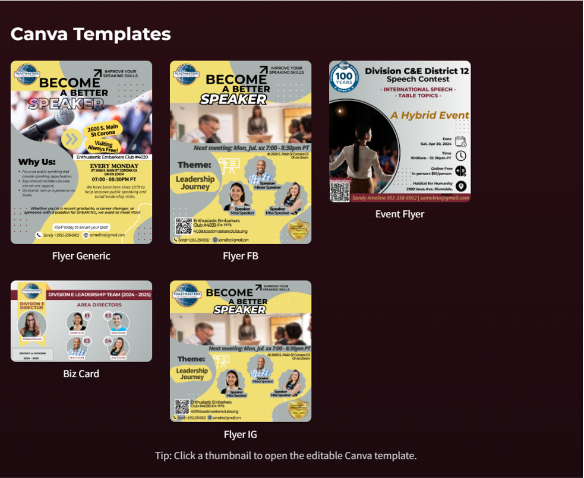

# Toastmasters Brand Kit

A lightweight **web-based toolkit** to help Toastmasters VPPRs and club officers access brand-compliant assets quickly.  
This repo is optimized for embedding into **Free Toast Host (FTH)** club sites and publishing on **GitHub Pages**.

---

## 🌟 Features
- **Hero Cover** with official Brand Manual download.
- **Color Palette** (True Maroon, Loyal Blue, Cool Gray, Happy Yellow).
- **Brand Fonts**: Montserrat, Source Sans Pro, Corinthia, Luxurious Script (with sample usage and downloads).
- **Logos**: Toastmasters logos, lockups, wordmarks, pathways, centennial — with thumbnails and ZIP downloads.
- **Icons**: Toastmasters pins and Pathways badges with labels.
- **Picture Stocks**: 37 certified Toastmasters photos, linked via Cloudinary gallery.
- **Canva Templates**: 5 editable Canva templates with thumbnails and direct links.

---

## 📂 Repo Structure
```
assets/
  ├── logos/                  # Toastmasters logos by category
  ├── ToastmasterBadge/       # Icon pins and Pathways badges
  ├── TemplateThumbnails/     # Canva template thumbnails
  ├── screenshots/            # Screenshots of each section
  ├── Cover-for-TMs-Brand-Manual.png
  └── ...
index.html                    # Main HTML file (embed-ready)
```

---

## 🚀 Usage
### Free Toast Host (FTH)
1. Create a custom page (e.g., `toastmastersbrandkit.html`).
2. Copy `index.html` contents and paste into the FTH editor.
3. Save — the brand kit appears embedded.
4. Here is a live page: https://4039.toastmastersclubs.org/toastmastersbrandkit.html

### GitHub Pages
1. Enable GitHub Pages for this repo (branch: `main`, folder: `/root`).
2. Visit your live kit:  
   `https://bond7010.github.io/tm-brand-kit-assets/`

---

## 📸 Screenshots

### Hero Cover


### Colors


### Fonts


### Logos


### Icons


### Picture Stocks


### Canva Templates


---

## 📸 Credits
- **Toastmasters International** for brand guidelines & assets.
- **Cloudinary** for image hosting.
- **GitHub Pages** for free static hosting.

---

## 🤝 Contributing
Suggestions, pull requests, and local club adaptations welcome!

---

© 2025 Toastmasters Brand Kit MVP — Built with ❤️ for District 12 clubs.
